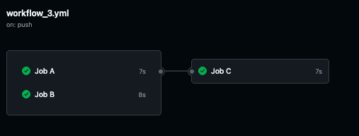
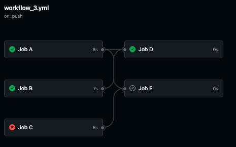
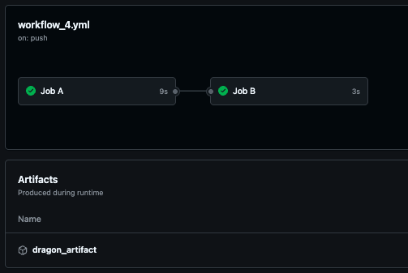
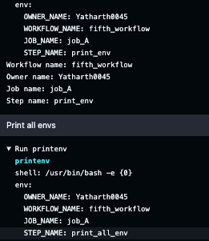

## Github Actions Sample Repo

Added quickstart action yamls to start github actions

## Github Workflows

1. first_workflow
    - workflow
    - jobs
    - steps

2. second_workflow
    - clone the repo
    - read repo files
    - install and run a program (cowsay)

3. third_workflow
    - run multiple jobs
    - run jobs in parallel  
    
    - job skip if dependent job fails  
    

4. fourth_workflow
    - sharing artifacts among jobs  
    

5. fifth_workflow
    - using variables and secrets
    

6. sixth_workflow
    - workflow trigger options
        - event filters
        - activity types
    - [all-available-options](https://docs.github.com/en/actions/writing-workflows/choosing-when-your-workflow-runs/events-that-trigger-workflows)

7. seventh_workflow
    - job concurrency
    - configure job timeouts

8. eighth_workflow
    - matrix configuration
        - include
        - exclude
        - fail-fast
        - max-parallel

9. ninth_workflow
    - workflow contexts
    - [all-available-contexts](https://docs.github.com/en/enterprise-cloud@latest/actions/writing-workflows/choosing-what-your-workflow-does/accessing-contextual-information-about-workflow-runs)

10. tenth_workflow
    - if expression

## Ading commit message as following
```
[skip ci]
[ci skip]
[no ci]
[skip actions]
[actions skip]
```

## adding another commit as follows
```
commit-message


skip-checks:true
## or
skip-checks: true
```

- commit failed
Commit message command to be used
```
git commit --cleanup=verbatim --message '''
This is my commit message


skip-checks:true
'''
```

